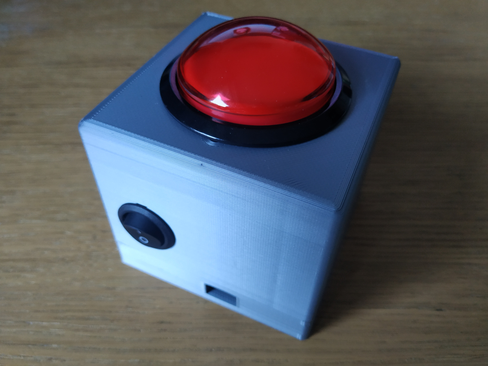
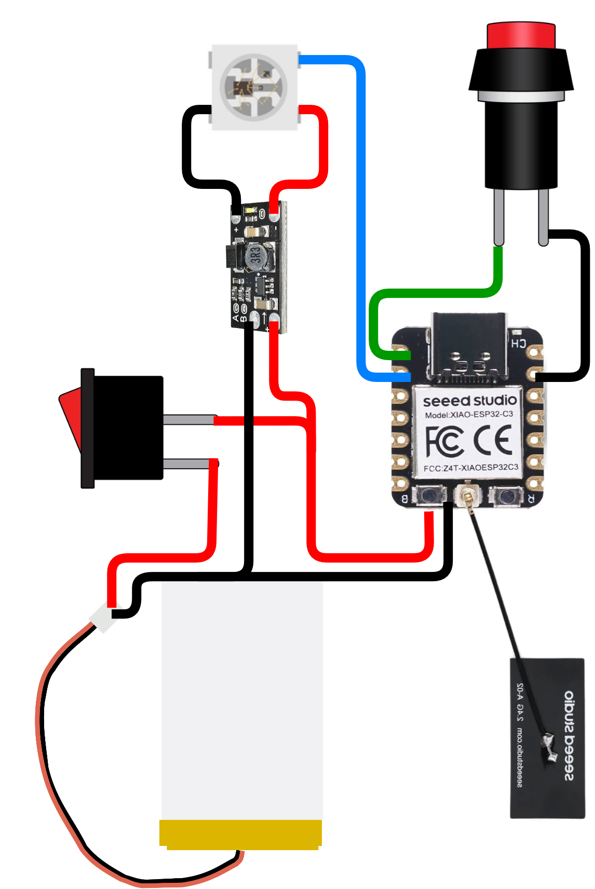

# Neon Beat Buzzer



## Brief

This repository contains the Neon Beat Buzzers firmware, written in no_std
rust. This firmware aims to run on an esp32c3 target to support the
following features involved in a Neon Beat game:
- connecting to the Neon Beat controller (NBC) over wifi, and then
  connecting to the corresponding websocket server
- listening to button pushes on a specific gpio, and sending push
  notifications to the NBC
- receiving, parsing and executing led commands to display the buzzer
  status on a ws2812 led, wired to a single gpio

## Project status

This Neon Beat Buzzer firmware has reached a level of maturity allowing to
play Neon Beat games without issues; the current scope of the code base
supports all needed features for a game.
There is still some pending tasks:
- some minor features are currently not supported, e.g interpreting some
  specific pattern duration/period/duty cycle for leds
- the code base could still receive quite some refactoring:
  - more idiomatic Rust
  - better configuration management
  - better error handling
  - etc
- there is currently almost no developper or user doc
- there is no CI automation

The project is actually a Rust rewrite of a former C firmware which can be
found at https://github.com/tropicao/neon-beat-buzzer

## Buzzer architecture

The Neon Beat buzzer is built with very basic electronic parts that can be
assembled by following the diagram and instructions below:



- The buzzer core is a [Xiao
  esp32c3](https://wiki.seeedstudio.com/XIAO_ESP32C3_Getting_Started/) from
  Seeed Studio. This module is especially fitting for this project as it
  comes both with an antenna connector and a battery charger included in
  the module.
- The module is powered by a 3.7V LiPo battery, soldered directly onto the
  pads on the bottom side of the module. For the record, a 320mAh LiPo
  battery can support a buzzer for about one hour, based on rough
  estimates.
- There's an On/Off switch between the battery and the module to allow
  powering on/off the buzzer.
- The main arcade button needs to be connected to one of the module GPIOs
  (by default, GPIO2), and ground
- The buzzer contains a WS2814 LED, which needs 5V, so the design includes
  a [5V
  boost](https://www.amazon.fr/dp/B0D2CSHWC4?ref=ppx_yo2ov_dt_b_fed_asin_title)
  to raise the voltage to the level needed by the LED
- The LED is powered by the Boost, and driven by another GPIO from the main
  module (by default, GPIO3)
- Xiao esp32c3 modules are delivered with a patch antenna, this one can be
  applied inside the buzzer casing, ideally not too close from the rest of
  the electronic to prevent electromagnetic disturbance.

## Build and run the project

- install [rustup](https://rustup.rs/)
- install the needed toolchain thanks to `rustup`:
```sh
$ rustup target add riscv32imc-unknown-none-elf
```
- install [espflash](https://github.com/esp-rs/espflash/):
```sh
$ cargo install espflash --locked
```
- plug a Neon Beat Buzzer into your computer through a USB C cable
- build the project and flash the buzzer:
```sh
$ cargo run
```

## Customizing the firmware configuration

The buzzer will try to connect to a properly configured NBC, thanks to a
default configuration. The following environment variables control the
connection parameters:

| Variable | Description | Default |
|----------|-------------|---------|
| `NBC_SSID` | WiFi network name to connect to | `nb_ap` |
| `NBC_PASSWORD` | WiFi network password | `nb_ap14789` |
| `NBC_BACKEND_PORT` | WebSocket server port on the NBC | `8080` |

Default values are defined in `.cargo/config.toml`. To override them,
set the environment variables before running cargo:

```sh
NBC_SSID="my_network" NBC_PASSWORD="my_password" cargo run
```

## Developpers' notes

The project has been generated thanks to
[esp-generate](https://github.com/esp-rs/esp-generate) with the following
command:

```sh
$ esp-generate --headless -c esp32c3 -o unstable-hal -o alloc -o wifi -o embassy -o log neon-beat-buzzer
```

The project is using the log crate coupled with esp_println. The firmware
only outputs by default logs down to info level. The log levels can be
tuned when re-flashing the buzzer:
- to get the main application debug logs:
```sh
ESP_LOG=neon_beat_buzzer cargo run
```
- to get ALL the debug logs (very verbose, as it includes all the debug
  logs from any component):
```sh
ESP_LOG=debug cargo run
```

